# 鸿蒙 MCP Toolbox 使用指导

## 更新公告

**arkts-diagnostic-0.0.3**

2026-01-26 10:00

- **ArkTS 高亮插件修复warning识别问题**

  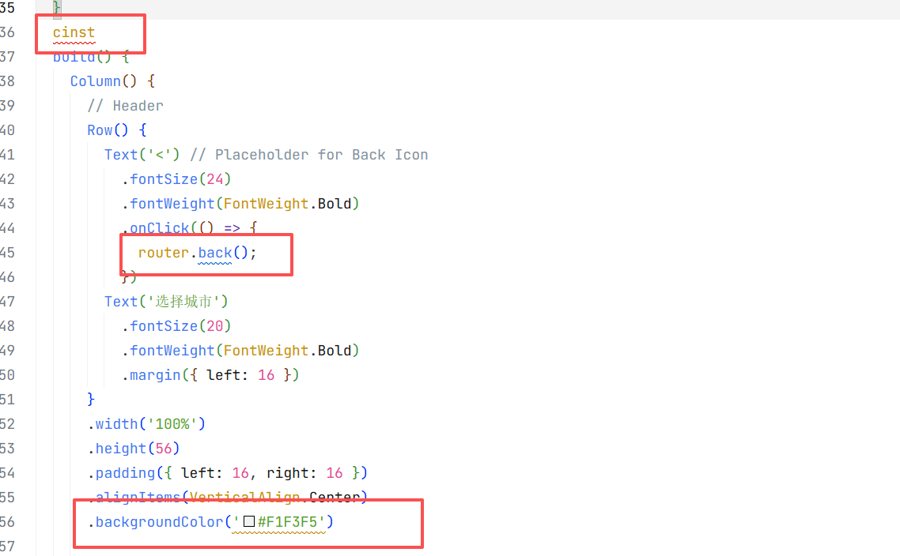

**v0.1.5**
2026-01-20 10:00

- 🌍 **新增国际版 Trae 支持**：全面支持 Trae 国际版，支持一键配置 MCP Server。
- 🎨 **UI/UX 重构**：
  - 全局 UI 更新，提供更现代化，更简单易用，更友好的用户界面。
  - 支持深浅色，中英文切换，用户可以根据个人喜好选择。
- **支持 MCP Tools 自定义**：用户可以根据自己的需求，自定义 MCP Tools 的配置。
- **支持 ArkTS 高亮插件一键安装**：用户可以在 Toolbox 中一键安装 ArkTS 高亮插件，支持安装到 Trae CN 与 Cursor 无需手动配置。
- **支持检查更新**：用户可以在 Toolbox 中检查是否有新版本，若有新版本，会提示用户更新。
- **无需配置选择设备**：依赖配置中，不需要进行设备的选择。
- **支持日志的查看以及Git地址和问题反馈的跳转**：用户可以在 Toolbox 中查看 Toolbox 的日志，同时也可以跳转到 Toolbox 的 Git 仓库地址，以及提交问题反馈。

**v0.1.4**
2026-01-13 18:00

- 🌐 支持通过 GitHub 联网更新
- 📦 已上传至 npm 中心仓库，支持 npx 安装运行 
- ⚡ 支持配置信息修改之后 MCP 工具动态更新，无需重启 (仅部分 IDE 支持)
- 📚 知识库内容更新 API 22 相关内容
- 🎨 添加 ArkTS 语法高亮 / 校验插件

**v0.1.3**
2026-01-06 18:00

- 📦 新增功能
  - 新增了 "Add to Cursor/Trae CN" 功能，用户可以直接将 MCP 配置添加到 Trae 中。
  - 新增模拟器截图并保存到本地功能。
  - 支持多真机/模拟器使用
  - 呈现 MCP tools 可用情况，若 tools 不可用，会提示用户缺少什么配置。
  - 优化工具箱 MCP 使用形式，只需要配置一次路径，后续可在 Toolbox 关闭的情况下连接 MCP 进行使用。
- 🔧 优化与修复
  - 简化表单，用户可只填写 DevEco Studio 路径，按需配置镜像与模拟器路径。
  - 优化文件选择逻辑，可以打开已选择文件路径。
  - 提供自动检测路径并自动提交配置。

**v0.1.2**
2025-12-27 18:00

- 📦 新增功能
  - 应用支持 "工具介绍栏" 或者 "环境依赖检查" 栏切换。

**v0.1.1**
2025-12-26 18:00

- 🔧 优化与修复
  - 优化了 ArkTS-Check 在检查多文件时的效率和返回格式。

## Toolbox 使用指导

### 存储位置

#### Windows 安装指引

将windows的zip压缩包解压到本地，其中文件夹应该包含 `deveco-toolbox.exe`、`deveco-mcp-server.exe` 与 `arkts-diagnostic-0.0.1.vsix` 三个文件，双击打开 `deveco-toolbox.exe` 进行配置。

#### MacOS 安装指引

1. 将 dmg 文件下载到本地后，双击进行安装；
2. 打开终端，输入命令：
   ```bash
   xattr -cr /Applications/DevEco\ Toolbox.app
   ```
3. 执行完命令后，双击打开 DevEco Toolbox app 进行配置。

### 使用方法

#### 第一步：配置依赖工具路径

首次打开 `Toolbox`，需要在 `Toolbox` 中进行 DevEco Studio 路径，DevEco Studio 为必填项；

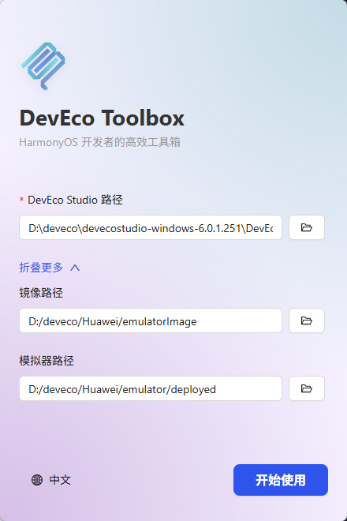

如需要模拟器能力，可以点击展开更多，进行镜像安装路径，以及模拟器安装路径的配置，这两项按需填写；
已提供自动检测路径，可以一键填充（注意镜像与模拟器安装路径，若路径下无镜像与模拟器，需要手动在IDE中下载）。

**路径示例**：
- DevEco Studio：`D:\deveco\devecostudio-windows-6.0.1.251\DevEco Studio`
- 镜像(为 DevEco Studio 当中，设备管理中镜像安装地址)：`D:/deveco/Huawei/emulatorImage`
- 模拟器(为 DevEco Studio 当中，设备管理中模拟器安装地址)：`D:/deveco/Huawei/emulator/deployed`

配置完对应的路径后，点击提交。

#### 第二步：添加 MCP Server

##### 方法一：Toolbox 一键添加 MCP Server

鼠标悬浮到 DevEco MCP 服务的 “添加到…”，选择需要添加 MCP 服务的 IDE，等待跳转添加。

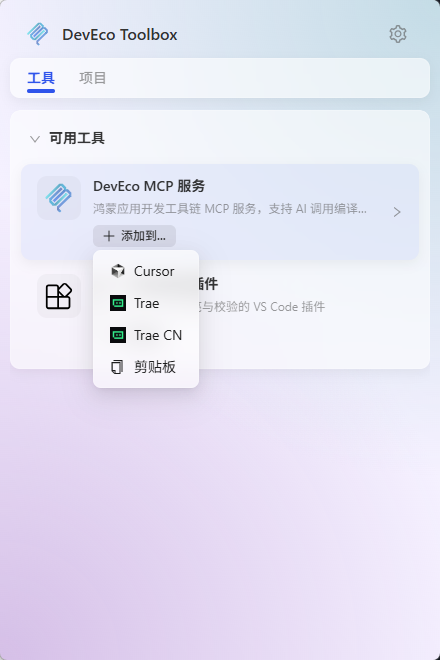

跳转后点击确认/install即可完成配置

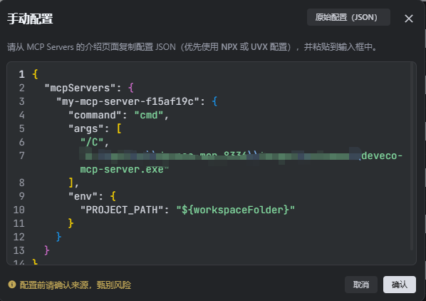

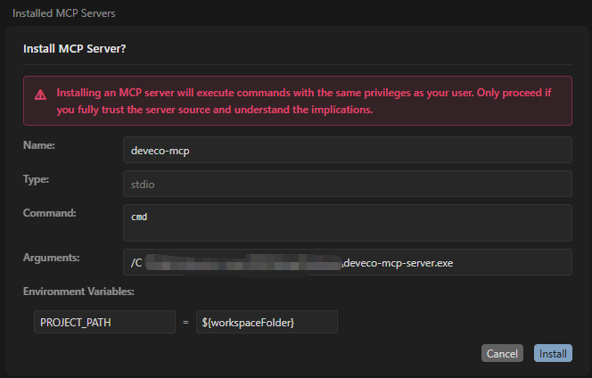

点击确认后，查看连接上的 MCP Tools。

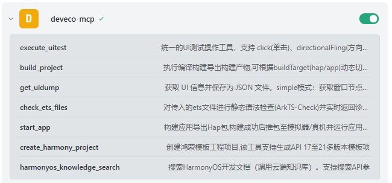

##### 方法二：通过 npx 添加 MCP Server

从v0.1.4版本开始，支持通过npx配置鸿蒙工具箱 MCP，该方法将拉取最新版本Toolbox与MCP Server。

```
{
  "mcpServers": {
    "deveco-mcp": {
      "command": "npx",
      "args": [
        "-y",
        "deveco-mcp-server"
      ],
      "env": {
        "PROJECT_PATH": "${workspaceFolder}",
        "DEVECO_PATH": “path/to/your/deveco"
      }
    }
  }
}
```
连接成功后，就可以开始使用鸿蒙工具箱 MCP。

> **Notice:**
> 若 IDE 暂不支持项目路径解析，请手动将 `Project_Path` 设为实际项目路径。
> 在大型工程下，工具箱会占用部分内存。

### 其他功能

#### 自定义 MCP Tools 配置

点击 DevEco MCP 服务卡片，在工具详情界面进行tools的自定义配置。从 v0.1.5 版本起，配置修改后支持热重载，在部分 IDE 中无需重启即可直接生效，大幅提升配置调整效率。


#### 一键安装插件

在首页点击 "添加到..." 按钮，选择目标 IDE（如 Trae CN / Cursor），即可一键将 ArkTS 高亮插件配置到开发环境中，无需手动繁琐操作。


#### 检查更新

点击首页右上角设置图标，选择 "检查更新" 选项。系统将通过 GitHub 检查最新版本，若有更新将弹窗提示，点击确认即可自动下载并安装。

​					 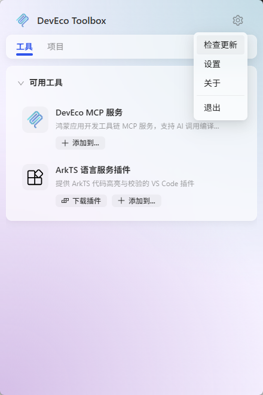 

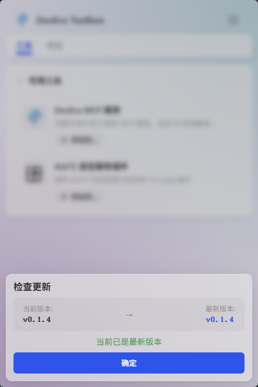

#### 个性化设置 & 配置路径修改

进入设置页面，可根据喜好切换 "深色/浅色" 主题及 "中文/英文" 语言。同时支持重新配置 DevEco Studio、模拟器及镜像的本地路径，修改后自动保存。

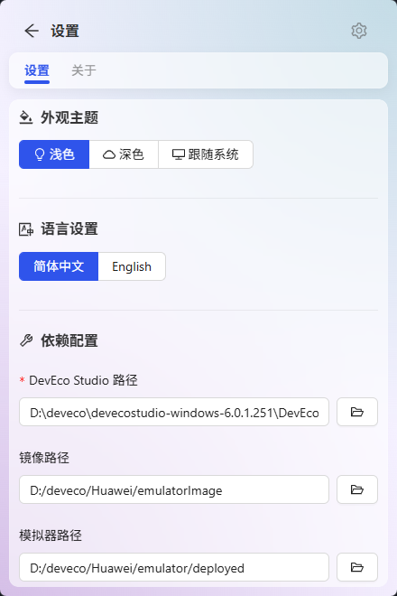

#### 日志地址跳转 & Git 地址与问题反馈地址跳转

在 "关于" 页面，点击 "查看日志" 按钮可打开日志目录排查问题。点击 GitHub 图标可访问代码仓库，点击 "反馈问题" 可跳转至 Issue 页面提交建议。

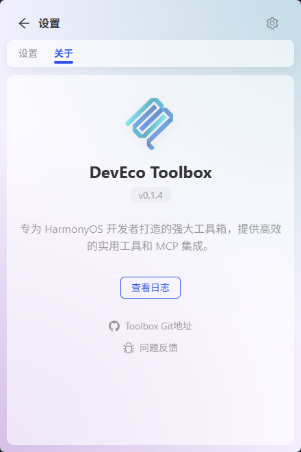


## ArkTS校验和高亮插件

### 优势

市面上开源ArkTS插件都是基于鸿蒙官网code-linter插件开发，本插件是基于鸿蒙官方DEVECO STUDIO编辑器的LSP语言服务器开发，更贴近官方，检查错误更加全面

### 使用前提

按照上述配置，在ide中配置好mcp工具。

### 安装方式

安装方式一：在 Toolbox 中直接一键安装 ArkTS 高亮插件


安装方式二：手动安装 ArkTS 高亮插件
若本地没有配置对应IDE的bin路径为环境变量，需要手动安装 ArkTS 插件。
打开Toolbox所在目录，找到 ArkTS 高亮插件 vsix，将插件拖到对应 IDE 插件市场进行安装，安装好后，重启ide。

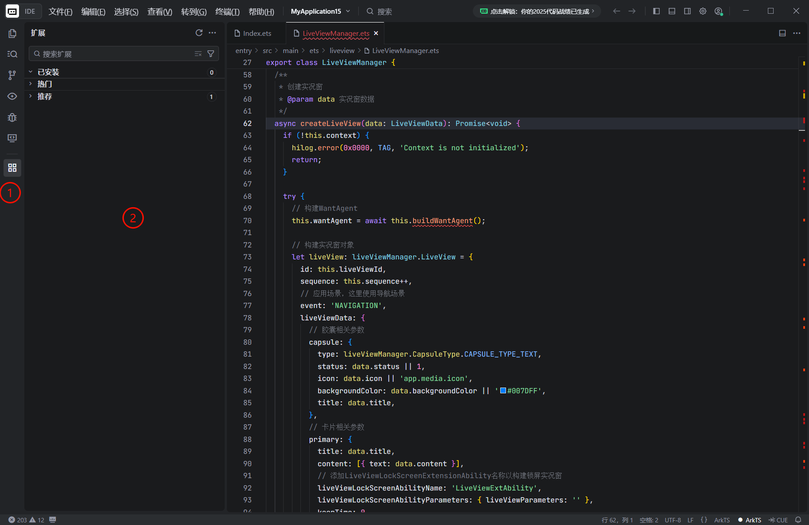

### 使用方式

打开ide后，右下角有一个状态，表示插件正在初始化，当插件初始化完成后，会变为白色，表示可以正常校验ArkTS语法
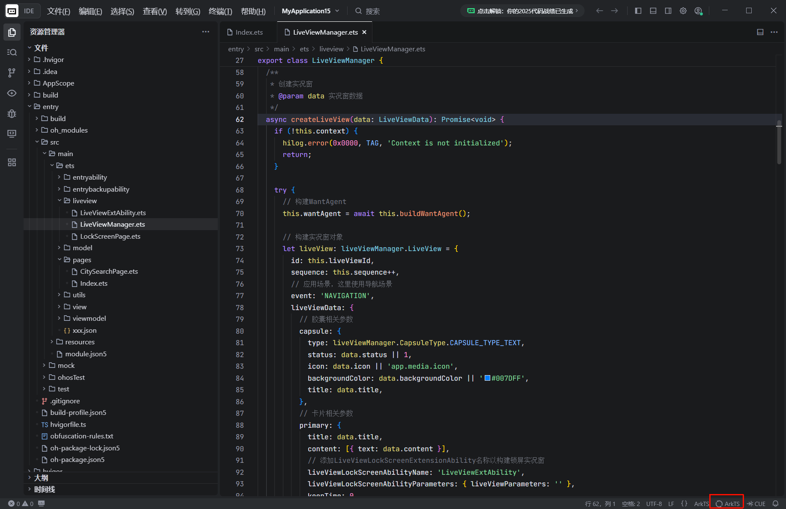
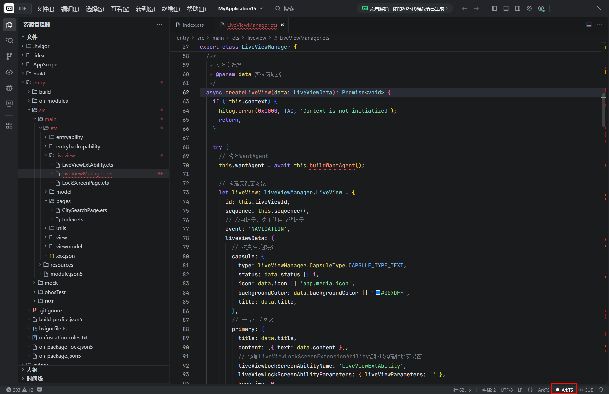

## Toolbox 使用最佳实践

### 使用示例Check+Knowledge实现API升级

<video src="./guide/Check+Knowledge Demo.mp4"></video>

### Emulator+Dump获取页面结点信息辅助UI布局检查

<video src="./guide/Dump.mp4"></video>

### MCP Tools 使用指导

#### 1. Knowledge Base

<video src="./guide/Knowledge.mp4"></video>

**What:**

实时更新的鸿蒙知识库工具，包含官方文档、API 参考、最佳实践、常见问题解决方案以及版本更新情况等内容。

**How:**

JSON 配置：

```json
{
  "mcpServers": {
      "knowledge-base": {
        "enabled": true,
        "url": "https://8.152.217.126/mcp"
      }
    }
}
```

**Parameter:**

| 参数 | 必选/可选 | 描述 | 默认值 | 格式 / 取值说明 |
| :--- | :--- | :--- | :--- | :--- |
| `--keywords` | 必选 | 关键词 | 无 | 无需额外输入 [] |
| `--maxtoken` | 可选 | 最大 token | 10000 | 至少返回一个完整答案 |

**使用示例:**

> ```Plain
> 1.用户：数据库应该怎么使用
> 
> 2.执行harmonyos_doc_search工具获取所需知识
> 
> 3.系统响应：查询到的信息
> ```
>
> 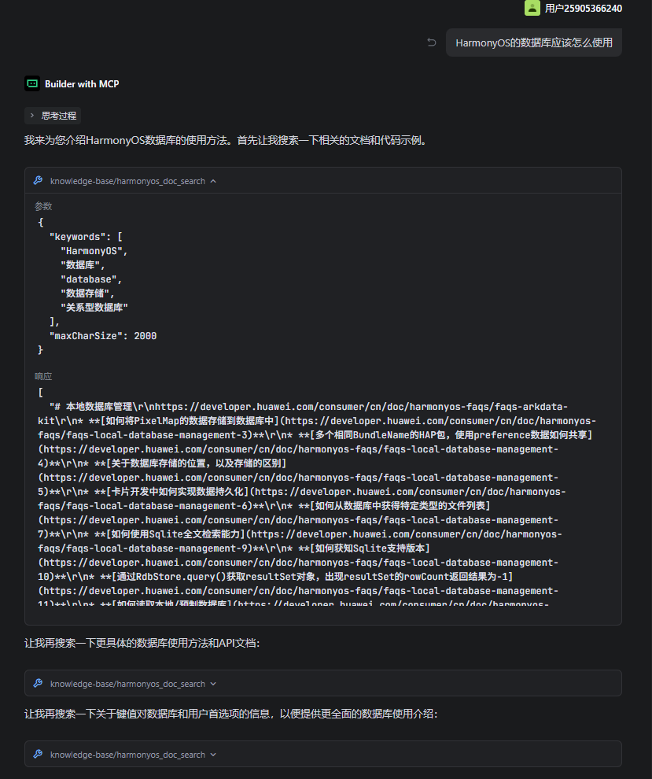


#### 2. ArkTS Check

<video src="./guide/Check.mp4"></video>

**What:**

对一个或多个 ets 文件进行校验，输出静态语法报错信息。

**Parameter:**

| 参数 | 必选/可选 | 描述 | 默认值 | 格式 / 取值说明 |
| :--- | :--- | :--- | :--- | :--- |
| `--files` | 必选 | 被检查的文件路径 | 无 | `path/to/your/xx.ets...` |

**使用示例:**

> ```SQL
> 1.用户：静态检查一下pages下的文件
> 
> 2.执行check_ets_files工具获取所选文件语法报错信息
> 
> 3.系统响应：文件诊断结果
> ```
>
> 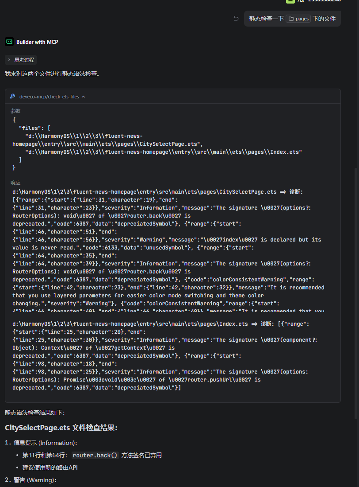


#### 3. UI dump

<video src="./guide/Dump.mp4"></video>

**What:**

获取模拟器/真机当前界面结点内容，支持 Full/Simple 两种模式。

通过Full模式可以获取当前界面的全部结点信息如**结点对应代码位置**：


| 维度 | 包含内容 | 用途 |
| :--- | :--- | :--- |
| 1. 顶层帧信息 | VsyncID、ProcessID、WindowID、物理宽高、逻辑密度 | 对齐 Systrace，确认抓帧时刻与进程窗口 |
| 2. 组件树结构 | 每一个 ArkUI 结点（类型、ID、父子关系、结点对应代码位置） | 层级是否过深、节点是否冗余 |
| 3. 布局几何 | 绝对坐标、尺寸、margin/padding、对齐方式 | 肉眼还原 UI，快速定位错位、溢出 |
| 4. 样式与绘制 | 背景色、圆角、边框、阴影、渐变、混合模式 | 排查过度绘制、圆角性能、图层数量 |
| 5. 状态与数据 | `@State` 变量名、当前值、依赖了哪些组件 | 精确定位数据 → UI 的刷新粒度 |
| 6. 事件与交互 | clickable、focusable、responseRegion | 是否可点、热区大小、键盘/遥控器支持 |
| 7. 辅助功能 | accessibilityText、level、group | 无障碍朗读、自动化测试 |
| 8. 性能标记 | renderGroup、scrollable、renderFit、dirty 标记 | 是否被提升为独立图层、是否触发重排/重绘 |

e.g：
 [full_dump_FluentNews_20251223205519094.json](full_dump_FluentNews_20251223205519094.json) 

通过 Simple 模式可以获取如下信息：

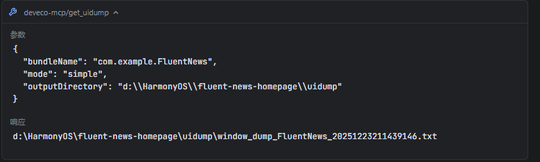

| 维度 | 字段示例 | 用途 |
| :--- | :--- | :--- |
| 1. 应用与窗口元数据 | 包名、模块名、dump 时间、窗口名、DisplayId、进程 PID、朝向、隐私模式、可见性标志 | 确认进程身份、窗口生命周期、抓帧时刻、是否可截屏/投屏 |
| 2. 窗口几何与渲染属性 | 逻辑分辨率、缩放系数、scale/offset/rotate 矩阵、已绘制第一帧标志、Decor 状态 | 还原真实像素区域、判断动画/缩放/旋转、检测首帧完成度 |
| 3. 节点树结构（Hierarchy） | 父子关系、同级顺序、节点 ID、childCount、childTree 指针 | 快速定位层级深度、节点冗余、懒加载子树 |
| 4. 节点通用属性 | 类型（Column/Row/Text/Button/Divider）、可见性、可点击/可长按/可滚动/可勾选状态、勾选值 | 交互能力、自动化测试脚本、无障碍遍历 |
| 5. 无障碍专用字段 | text（朗读文本）、accessibilityText、accessibilityGroup、accessibilityLevel、accessibilityCustomRole、hint | 读屏软件朗读内容、无障碍合规检查、自动化测试定位 |
| 6. 布局与坐标 | left/top/width/height（相对于父节点的绝对坐标）、clickable 区域、是否支持焦点 | 还原 UI、排查错位/溢出、热区大小验证 |
| 7. 运行时调试辅助 | lastRequestVsyncTime、transactionFlags、finishCount、vsyncId | 卡顿/掉帧分析、帧率对齐、GPU 合成问题追踪 |

e.g：
 [simple_dump_FluentNews_20251223211439146.json](simple_dump_FluentNews_20251223211439146.json) 

**Parameter:**

| 参数 | 必选/可选 | 描述 | 默认值 | 格式 / 取值说明 |
| :--- | :--- | :--- | :--- | :--- |
| `--mode` | 必选 | dump 详细程度 | 无 | `full`/`simple` |
| `--outputDirectory` | 必选 | dump 输出路径 | 无 | `path/to/your/dump.json` |

**使用示例:**

> ```SQL
> 1.用户：获取全部dump信息
> 
> 2.执行get_uidump工具获取全部结点信息
> 
> 3.系统响应：结点信息保存路径
> ```
>
> 

> **Notice**:
>
> 1. 相较于Simple模式，Full模式下结点信息较多
> 2. 需要提前配置**SDK**
> 3. 使用该工具时需关闭DevEco Studio
> 4. 使用该工具前需在推包前的编译构建中增加对应参数**debugLine=true**或使用**start_app** tools。


#### 4. Ui Test

<video src="./guide/Dump.mp4"></video>

**What:**

​	UI测试工具，支持 click（单击）、directionalFling（方向滑动）、inputText（输入文本）、keyEvent（按键事件）、截图（Screenshot)五种操作类型。

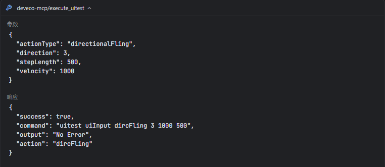

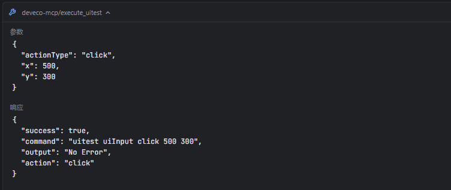

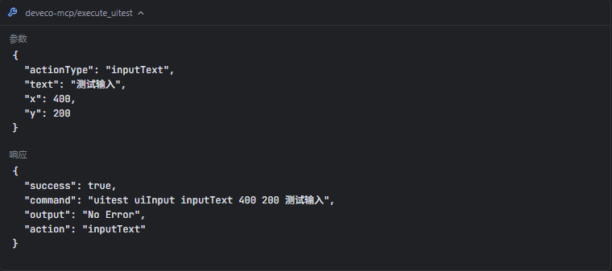

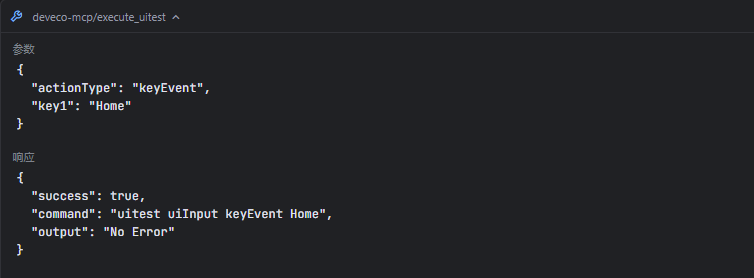

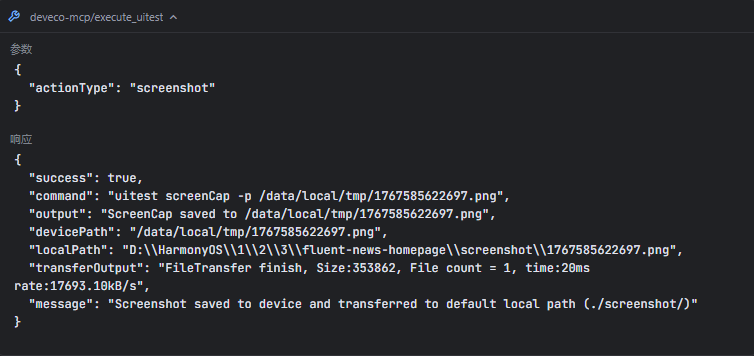

**Parameter:**

| 参数 | 必选/可选 | 描述 | 默认值 | 格式 / 取值说明 |
| :--- | :--- | :--- | :--- | :--- |
| `--actionType` | 必选 | 所执行操作 | 无 | `click`/`directionalFling`/`inputText`/`keyEvent` |

> **Notice:**
> a. 需要提前配置 SDK
> b. 功能可以与 UI dump 或其他实时读取应用日志功能相结合进行自动化测试

**使用示例:**

> ```SQL
> 1.用户：截图
> 
> 2.执行execute_uitest工具进行截图操作
> 
> 3.系统响应：图片保存路径
> ```
>
> 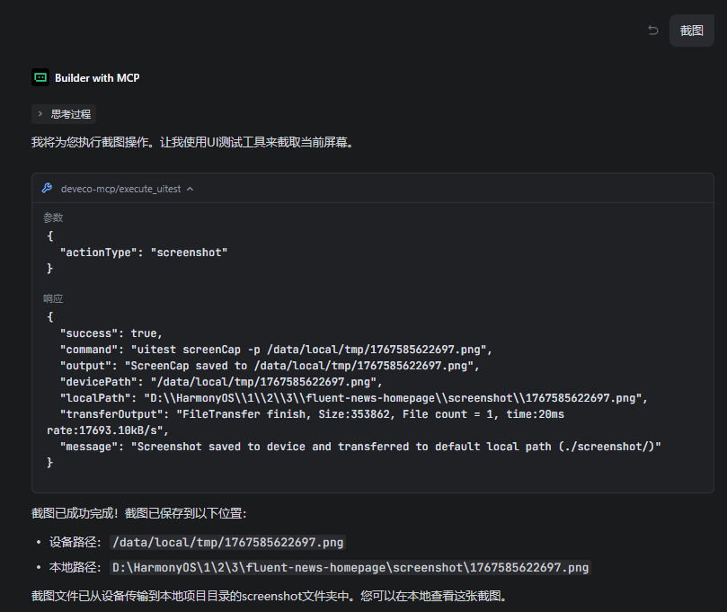


#### 5. Build

<video src="./guide/Build.mp4"></video>

**What:**

编译构建工具，支持构建 Hap 应用/App 应用。

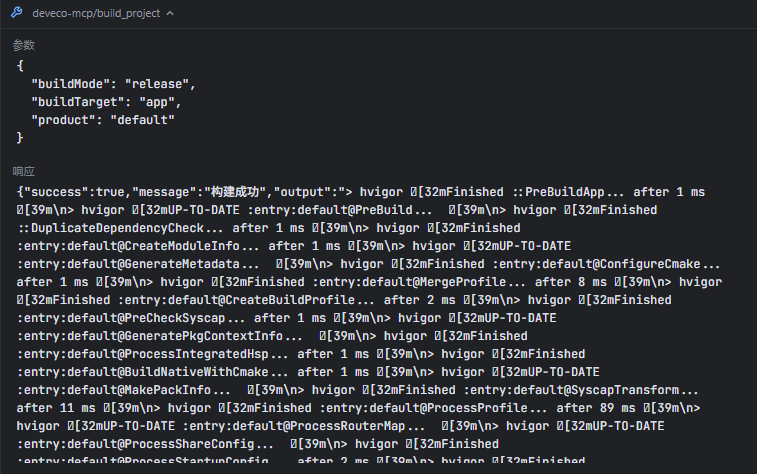


**Parameter:**

| 参数 | 必选/可选 | 描述 | 默认值 | 格式 / 取值说明 |
| :--- | :--- | :--- | :--- | :--- |
| `--buildTarget` | 必选 | 构建类型 | 无 | Hap 应用/App 应用 |

> **Notice:**
> 需要提前配置 hvigorw、Node.js


**使用示例:**

> ```SQL
> 1.用户输入:"构建一下"
> 
> 2.执行build_project工具进行hap构建
> 
> 3.系统响应：构建成功！
> > hvigor UP-TO-DATE :entry:default@PreBuild...
> > hvigor Finished :entry:default@CreateModuleInfo... after 1 ms
> > hvigor UP-TO-DATE :entry:default@GenerateMetadata...
> > hvigor Finished :entry:default@ConfigureCmake... after 1 ms
> ...
> [可能的警告信息]
> ```
>
> 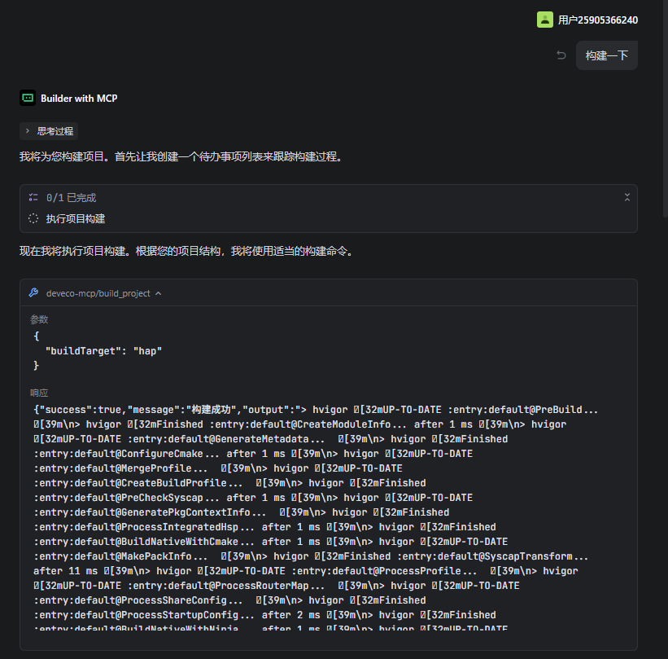

#### 6. Start_app

<video src="./guide/Emulator.mp4"></video>

**What:**

对应于进行编译构建，构建通过后拉起模拟器并将应用推包至模拟器上。


如果没有指定设备名称，返回可用设备列表。

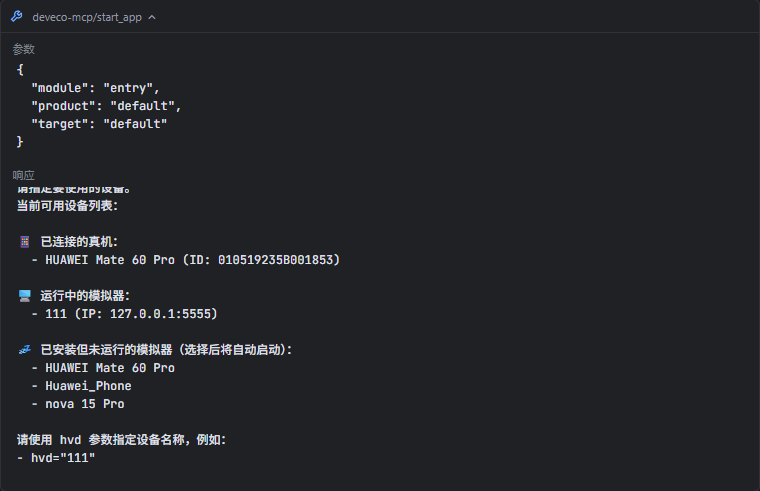

**Parameter:**

| 参数 | 必选/可选 | 描述 | 默认值 | 格式 / 取值说明 |
| :--- | :--- | :--- | :--- | :--- |
| `--hvd` | 可选 | 模拟器名称 | 无 | Huawei_Phone |
| `--requiredDeviceType` | 可选 | 设备类型 | 无 | `phone`/`tablet`/`2in1`/`wearable`/`tv` |
| `--target` | 可选 | TargetName | default | default |
| `--product` | 可选 | ProductName | default | default |
| `--module` | 必选 | ModuleName | entry | entry |

**使用示例:**

> ```SQL
> 1.用户输入:"启动应用"
> 
> 2.执行strt_app工具
> 
> 3.检测是否选择设备（hvd),若未选择则返回可用设备列表
> 
> 4.重新执行strt_app工具，进行构建+推包任务
> 
> 5.系统响应：构建成功！
> > hvigor UP-TO-DATE :entry:default@PreBuild...
> > hvigor Finished :entry:default@CreateModuleInfo... after 1 ms
> > hvigor UP-TO-DATE :entry:default@GenerateMetadata...
> > hvigor Finished :entry:default@ConfigureCmake... after 1 ms
> ...
> [可能的警告信息]
>            推包成功！
> > "message": "Application built, installed and started successfully on real device",
> > "deviceType": "real_device",
> > "deviceId": "010519235B001853",
> > "isEmulator": false,
> > "hapType": "signed",
> > "hapPath": "D:\\HarmonyOS\\1\\2\\3\\fluent-news-homepage\\entry\\build\\default\\outputs\\default\\entry-default-signed.hap",
> > "success": true,
> > "installOutput": "[Info]App install path:D:\\HarmonyOS\\1\\2\\3\\fluent-news-homepage\\entry\\build\\default\\outputs\\default\\entry-default-signed.hap msg:install bundle successfully. \nAppMod finish\n",
> > "startOutput": "start ability successfully.\n"
> ```
>
> 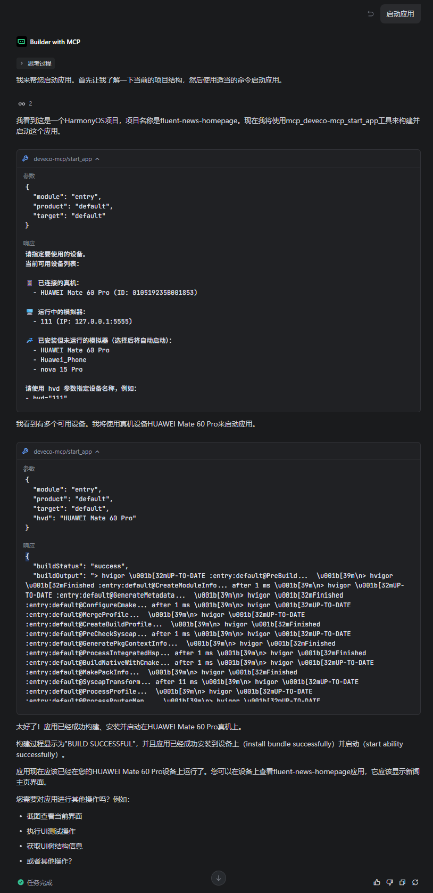

**Notice:**
需要提前配置镜像


# 卸载

> 1. Windows 版本可直接删除，所有数据仅存在该应用所在目录下
> 2. mac 版本在此基础上还需额外执行如下指令：
>   ```bash
>    rm -r ~/Library/Application\ Support/deveco-toolbox
>   ```
